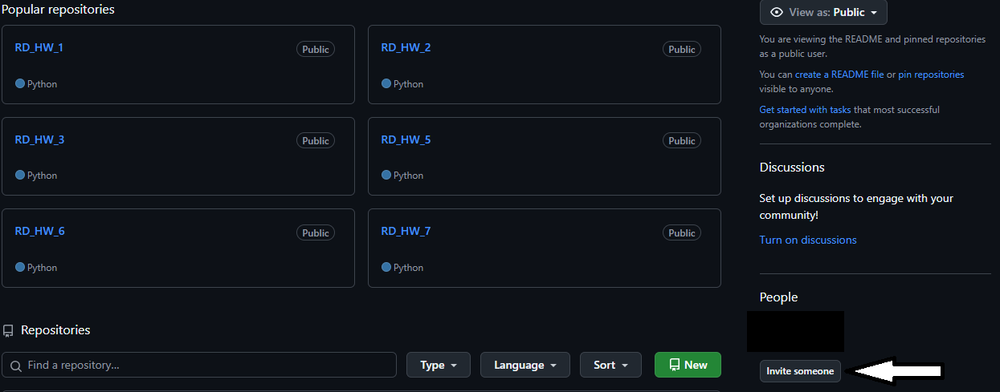

---
### Додавання користувачів:
1. **Натиснути Invite someone**
   
2. **Вписати нік або ім`я, або пошту користувача якого запрошуєм.**
   
3. **Надати права доступа Member, якщо необхідно, додати в команду**
   
4. **Відправити запрошення (Send invitation)**
---
