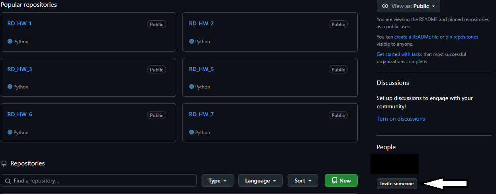
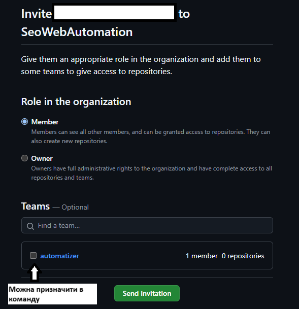
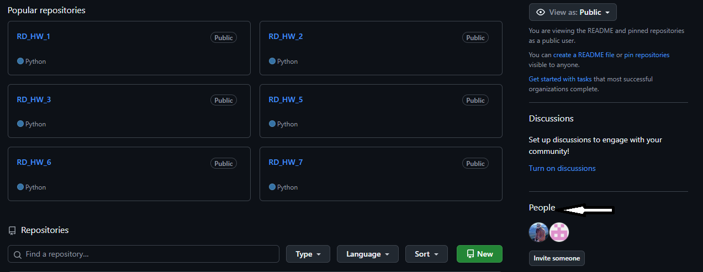

## Туторіали
- [Додати користувача до організації](#додавання-користувачів)
- [Видалити користувача з організації](#видалення-користувачів)

---
### Додавання користувачів:
1. **Натиснути Invite someone**
   
2. **Вписати нік, або імя або пошту користувача якого запрошуєм.**
   
3. **Надати права доступа Member, якщо необхідно, додати в команду**
   
4. **Відправити запрошення (Send invitation)**

---
### Видалення користувачів:
1. **Натиснути People**
   
